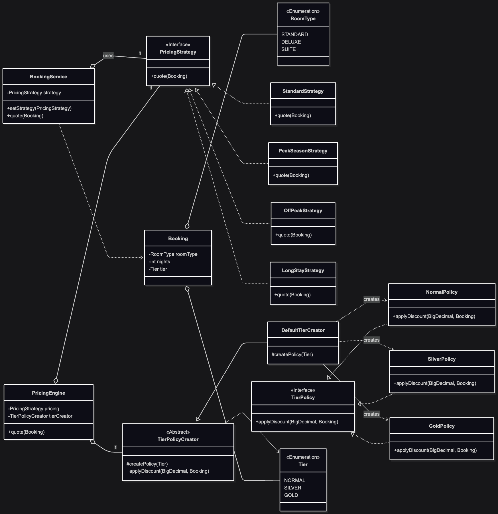

# design_pattern_class_5
## 디렉토리 구조
```
design_pattern_class_5 
├── ClassDiagram.png
├── 결과물.jpg
├── hotel
│   ├── decorator
│   ├── factory
│   │   └── method
│   │   └── room
│   ├── observer
│   └── strategy
└── README.md
```
## TODO
1. factory/method 구현체는 simple factory로 구현되어 있다. 이를 factory method pattern으로 변경하시오.
2. factory/room 에 있는 RoomType.java를 참고하여, factory mehtod pattern으로 룸 타입에 따른 요금제를 구현하시오.
3. 2번 구현후 factory/room 에 있는 RoomType.java는 삭제하시요.
4. factory/method/Demo.java에 1,2번 내용을 모두 반영하시오.
5. 콘솔 출력 결과물을 결과물.jpg로 저장하시오.
   
## 클래스 다이어그램

